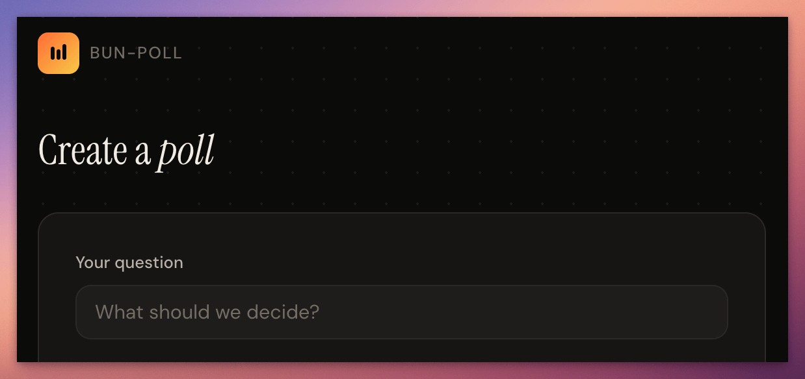

<div align="center">

# 🗳️ bun-poll

**Real-time polls, zero dependencies.**

A lightweight poll app built entirely with [Bun](https://bun.sh) native APIs.
No frameworks. No npm bloat. Just fast, live polls with WebSocket-powered updates.

[](LICENCE)
[](https://bun.sh)
[](https://www.typescriptlang.org/)
[](https://www.sqlite.org/)
[](#)



</div>

---

## Why bun-poll?

Most poll tools are over-engineered SaaS products or require a dozen packages just to get started. **bun-poll** takes a different approach:

- **Zero runtime dependencies** — only Bun and its built-in APIs
- **Single command to run** — no build step, no bundler config, no Docker
- **Real-time by default** — every vote broadcasts instantly via WebSockets
- **SQLite persistence** — WAL mode for concurrent reads, no external database needed

---

## Features

| | Feature | Description |
|---|---|---|
| ⚡ | **Instant creation** | Create polls in seconds — no sign-up required |
| 📡 | **Live results** | Votes broadcast to all viewers instantly via WebSockets |
| 👁️ | **Live viewer count** | See how many people are watching a poll in real time |
| 🔗 | **Shareable links** | Unique short URLs for voting, separate admin links for managing |
| ☑️ | **Single & multiple choice** | Configurable per poll |
| ⏱️ | **Poll expiry** | Optional time limit on voting |
| 🛡️ | **Vote deduplication** | One vote per browser, enforced client-side and at the database level |
| 📤 | **Results export** | Download results as CSV or JSON, or copy a plain-text summary |
| 🔧 | **Poll management** | Close voting early, reset votes, or delete polls from the admin page |
| 🛡️ | **Input guardrails** | Length limits, rate limiting on votes, and Content-Security-Policy headers |
| 💾 | **SQLite persistence** | WAL mode, zero external services |
| 🪶 | **Vanilla frontend** | No build step, no framework — just HTML/CSS/JS via Bun's HTML imports |

---

## Quick Start

```bash
# Install Bun if you haven't already
curl -fsSL https://bun.sh/install | bash

# Clone and install
git clone https://github.com/danjdewhurst/bun-poll.git
cd bun-poll
bun install

# Start the dev server
bun --hot index.ts
```

Open **[http://localhost:3000](http://localhost:3000)** to create your first poll.

---

## How It Works

1. **Create** a poll at `/` — enter a question, add options, hit create
2. **Share** the voting link with participants
3. **Vote** at `/poll/:shareId` — results appear live after voting
4. **Monitor** results at the admin link — real-time updates with a share link for easy distribution

---

## Project Structure

```
index.ts                      Entry point — Bun.serve() with routes & WebSockets
src/
  db.ts                       SQLite schema, migrations, prepared statements
  types.ts                    Shared TypeScript interfaces
  server-ref.ts               Module-level server reference for WS broadcasting
  routes/
    polls.ts                  API route handlers (create, get, vote, admin)
    websocket.ts              WebSocket open/close/message handlers
frontend/
  home.html / home.js         Poll creation page
  poll.html / poll.js         Voting & live results page
  admin.html / admin.js       Admin results & share link page
  styles.css                  Shared styles
index.test.ts                 Integration tests
```

---

## Configuration

| Variable | Default | Description |
|----------|---------|-------------|
| `PORT` | `3000` | Server port |
| `DB_PATH` | `bun-poll.sqlite` | SQLite database file path |

> Bun loads `.env` files automatically — no dotenv needed.

---

## Testing

```bash
bun test
```

Covers poll creation, voting, deduplication, expiry, multi-choice validation, and page rendering.

---

## Linting & Formatting

The project uses [Biome](https://biomejs.dev) for linting and formatting.

```bash
# Check for lint and formatting issues
bun run lint

# Auto-format all files
bun run format

# Check and auto-fix everything
bun run check
```

---

## Requirements

- [Bun](https://bun.sh) v1.1.0+

That's it. No other runtime dependencies. The database is SQLite via `bun:sqlite`, the server is `Bun.serve()`, and the frontend is plain HTML/CSS/JS bundled by Bun's HTML imports.

---

## Documentation

- **[Getting Started](docs/getting-started.md)** — installation, running, and configuration
- **[API Reference](docs/api.md)** — endpoints, WebSocket, request/response examples
- **[Architecture](docs/architecture.md)** — project structure, database schema, design decisions
- **[Testing](docs/testing.md)** — running tests, coverage, test suite reference

## Roadmap

See **[ROADMAP.md](ROADMAP.md)** for planned features and ideas — contributions welcome!

## Contributing

Feel free to open an issue or submit a pull request.

---

<div align="center">

**[MIT Licence](LICENCE)** — Made by [Daniel Dewhurst](https://github.com/danjdewhurst)

</div>
